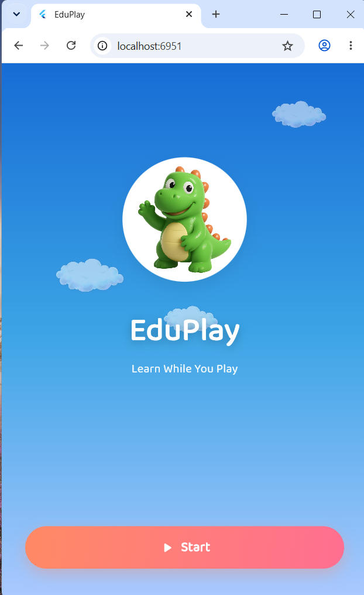
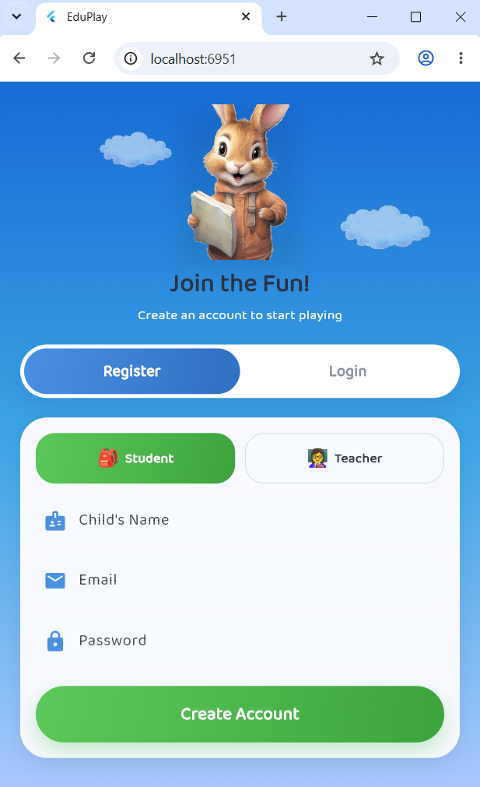
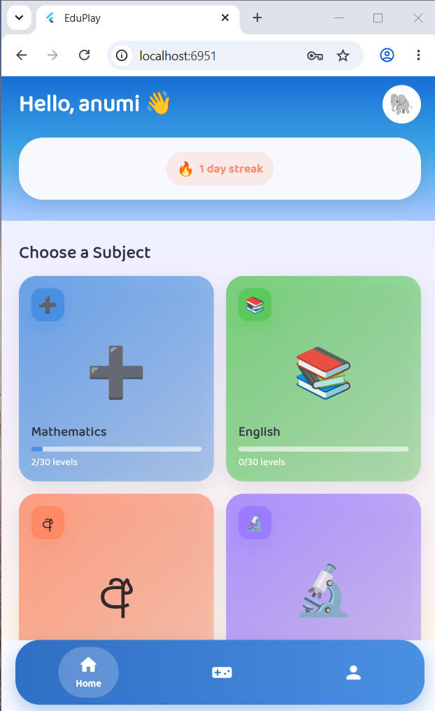
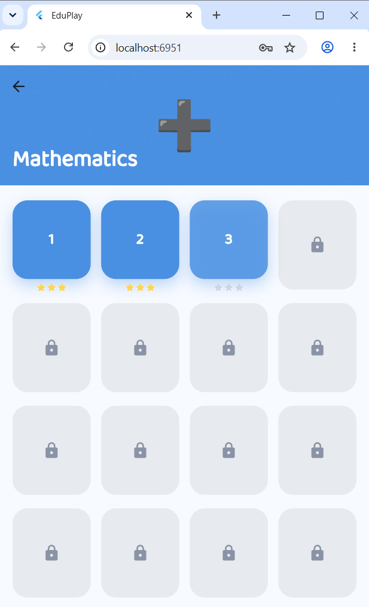
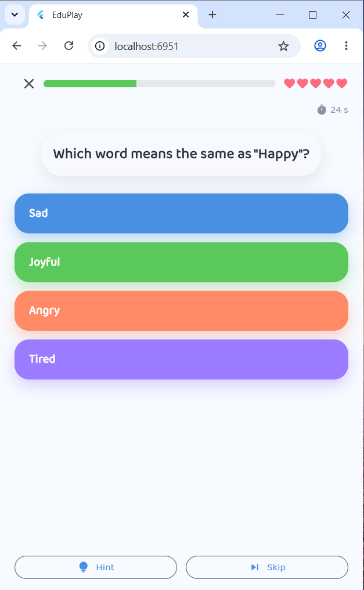
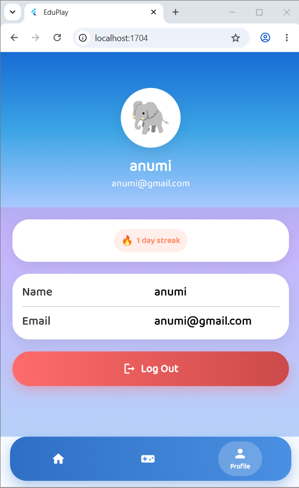
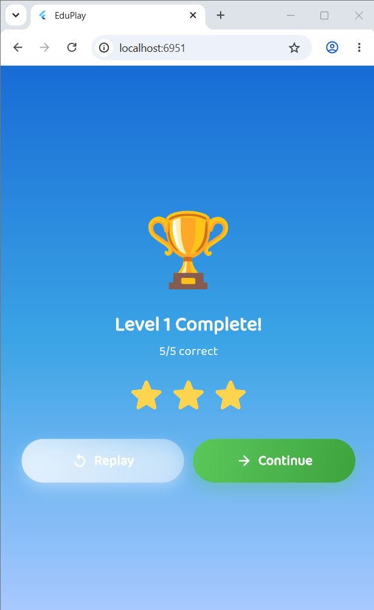
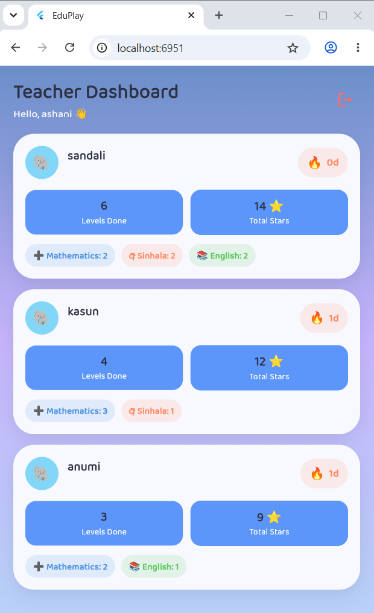

# EduPlay 🐘

> A colorful, Duolingo-style educational game app for Sri Lankan school children, built with **Flutter** and **Supabase**.


---

# 📖 About

EduPlay is a colorful, Duolingo-inspired educational mobile application developed for **Sri Lankan school children**. The application transforms traditional learning into an engaging game experience by combining quizzes, rewards, levels, and daily learning streaks.

Students can learn through interactive quizzes across four core school subjects while earning stars and unlocking new levels. Teachers can access a dedicated dashboard to monitor student progress and performance.

The application is developed using **Flutter** for the frontend and **Supabase** for backend services including authentication, PostgreSQL database management, and Row Level Security (RLS).

---

# ✨ Features

## 👨‍🎓 Student Features

- Secure email/password registration and login
- Interactive Home Dashboard
- Four educational subjects
- Level-based learning system
- Locked and unlocked level progression
- Star rewards for completed levels
- Daily learning streak tracking
- 30-second timer for every question
- Hint and Skip options
- Five-heart lives system
- Instant answer feedback
- Confetti reward animations
- Cloud-synchronized progress
- Profile management and logout

---

## 👩‍🏫 Teacher Features

- Teacher account registration
- Read-only Teacher Dashboard
- View all registered students
- Monitor learning streaks
- View total earned stars
- Track completed levels
- Monitor progress for every subject

---

## 📚 Subjects

- ➕ Mathematics
- 🔤 English
- 🇱🇰 Sinhala
- 🔬 Science

---

# 🛠 Tech Stack

| Layer | Technology |
|---------|------------|
| Frontend | Flutter |
| Language | Dart |
| Backend | Supabase |
| Database | PostgreSQL |
| Authentication | Supabase Auth |
| State Management | Provider |
| Security | Row Level Security (RLS) |
| Fonts | Google Fonts (Baloo 2) |
| Animations | flutter_animate, confetti |

---

# 📸 Screenshots

| Splash Screen | Login |
|---------------|-------|
|  |  |


| Home | Level Map |
|------|-----------|
|  |  |


| Quiz | Student Profile |
|------|-----------------|
|  |  |


| Reward | Teacher Dashboard |
|--------|-------------------|
|  |  |

---

# 🎥 Demo

Demo video:

> *(Add your YouTube or Google Drive demo link here.)*

Example:

```
https://youtu.be/your-demo-video
```

---

# 📂 Project Structure

```text
lib/
│
├── main.dart
├── theme/
│   └── app_theme.dart
│
├── models/
│   └── models.dart
│
├── providers/
│   └── app_state.dart
│
├── services/
│   └── supabase_service.dart
│
├── widgets/
│   └── common_widgets.dart
│
├── screens/
│   ├── splash_screen.dart
│   ├── auth/
│   │   └── auth_screen.dart
│   ├── home/
│   │   ├── home_screen.dart
│   │   └── main_shell.dart
│   ├── games/
│   │   ├── games_screen.dart
│   │   └── level_map_screen.dart
│   ├── quiz/
│   │   ├── quiz_screen.dart
│   │   └── reward_screen.dart
│   ├── profile/
│   │   └── profile_screen.dart
│   └── teacher/
│       └── teacher_dashboard_screen.dart
│
├── pubspec.yaml
└── README.md
```

---

# ⚙️ Database

The application uses three main database tables.

### profiles

Stores user information.

- User ID
- Name
- Email
- Role (Student/Teacher)
- Daily streak
- Last active date

### questions

Stores quiz questions.

- Category
- Difficulty
- Level number
- Question
- Multiple-choice options
- Correct answer
- Explanation

### user_progress

Stores completed quiz progress.

- User ID
- Subject
- Level
- Stars earned
- Completion date

---

# 🔐 Authentication

EduPlay uses **Supabase Authentication**.

Features include:

- Student Registration
- Teacher Registration
- Secure Login
- Logout
- Protected Routes
- Automatic Profile Creation
- Role-based Navigation

---

# ☁️ Supabase Configuration

The project includes:

- Row Level Security (RLS)
- Secure authentication
- Auto-created user profiles
- Student and Teacher roles
- Teacher read-only policies
- Daily streak management
- Quiz progress synchronization
- Seeded question data

---

# 🚀 Getting Started

## 1. Clone the Repository

```bash
git clone https://github.com/pabodha032/EduPlay.git
```

Go to the project folder.

```bash
cd EduPlay
```

---

## 2. Install Dependencies

```bash
flutter pub get
```

---

## 3. Configure Supabase

Open

```text
lib/main.dart
```

Replace with your own project values if needed.

```dart
const supabaseUrl = "YOUR_SUPABASE_URL";
const supabaseAnonKey = "YOUR_SUPABASE_ANON_KEY";
```

---

## 4. Run the Application

Android

```bash
flutter run
```

Web

```bash
flutter run -d chrome
```

Windows

```bash
flutter run -d windows
```

---

# 📌 Requirements

- Flutter SDK 3.x
- Dart SDK
- Android Studio or VS Code
- Supabase Project
- PostgreSQL Database

---

# 🎮 How It Works

### Student Flow

1. Register an account
2. Login
3. Choose a subject
4. Select a level
5. Answer quiz questions
6. Earn stars
7. Unlock new levels
8. Increase daily streak

### Teacher Flow

1. Register as Teacher
2. Login
3. Open Teacher Dashboard
4. View all students
5. Monitor progress
6. Track stars and completed levels

---


# 🚀 Future Enhancements

- Complete all 30 levels per subject
- Achievement and badge system
- Weekly and monthly leaderboards
- Parent dashboard
- Offline mode
- Push notifications
- AI-generated quiz questions
- Audio pronunciation
- Sound effects
- Sinhala, Tamil, and English localization
- Multiplayer quiz mode

---

# 👩‍💻 Author

**Pabodha Sewwandi**

Final Year ICT (Software Engineering) Undergraduate

Faculty of Technology

South Eastern University of Sri Lanka

**GitHub**

https://github.com/pabodha032

**LinkedIn**

www.linkedin.com/in/pabodha-sewwandi-1a4131399

---

# 🙏 Acknowledgements

- Flutter
- Dart
- Supabase
- Google Fonts
- South Eastern University of Sri Lanka

---

## ⭐ Support

If you like this project, consider giving it a ⭐ on GitHub.
